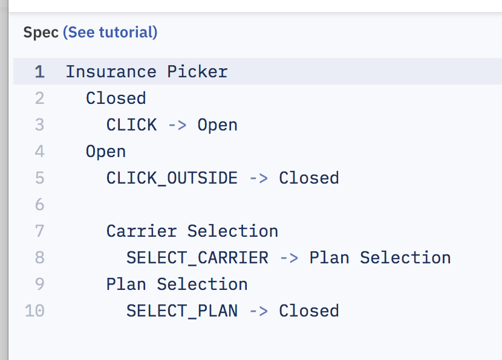
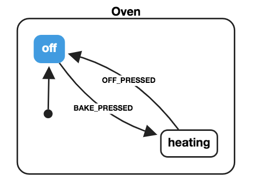

## Planning, Finite State Machines, And Brazilian Food

---

## Lucas Reis

Currently at Zocdoc in NYC 🇺🇸

Originally from Brazil 🇧🇷

_@iamlucasmreis_

---

### My third favorite brazilian food is Pão de Queijo

Cheese breads made from cassava flour, eggs, butter, and cheese.

_Gluten free!_

---

import { Image } from 'mdx-deck'

<Image src="https://upload.wikimedia.org/wikipedia/commons/thumb/2/20/Cheesebread.jpg/2560px-Cheesebread.jpg" />

---

Did you go from 

## Infinite Planning

to 

## No Planning At All

?

---

We used to have months of planning and no early feedback from our stakeholders, it was terrible...  

---

### ...but we are getting too far to the other side of the pendulum

---

_Wait, are you bringing back WATERFALL???_

---

No, I'm only claiming we need **some** planning

_not two months, but something from two hours to two days!_

---

1. Coding is more **costly** than planning
2. We are able to solve **big problems** and catch bugs with planning
3. During planning we're able to leverage knowledge of **non-coders** too 

---

The best planning tools are:

* **High-level** enough to be able to be developed by non-coders
* **Low-level enough** to actually help you with your code

---

### Finite State Machines Satisfy These Requirements!

(more specifically _Statecharts_)

---

Statecharts deal better with complexity 

* Add _modularity_ to regular FSMs
* Easier to design complex UIs
* Avoid state explosions

---

### Let's implement a UI component using statecharts!

---

### Health Insurance Picker _(inspired by Zocdoc)_

* Patient need to choose a **Carrier** and a **Plan** accepted by the Carrier
* The lists are fetched **asynchronously**
* Clicking in the input opens a **dropdown** with the options
* Clicking **outside** the dropdown closes it
* It is possible to **reset** the selection
* It is possibe to have a **partial** selection

---

<iframe 
    src="https://codesandbox.io/embed/7y5286moy1"  
    style={{ width: 500, borderRadius: "4px", overflow: "hidden", height: 500 }}
    sandbox="allow-modals allow-forms allow-popups allow-scripts allow-same-origin">
</iframe>

---

### My second favorite brazilian food is Camarão na Moranga

Shrimp cooked inside a pumpkin, with heavy cream and a lot of cheese

_You actually eat the pumpkin and it's delicious!_

---

<Image src="http://ducampeche.com.br/sites/default/files/camarao-moranga.jpg" />

---

## SketchSystems

Great starting point for sketching your Statechart

---

---

<iframe 
    src="https://sketch.systems/lucasmreis/sketch/13f3650ed126fd197855716a28588da6"
    frameborder="no"
    width="400"
    height="600">
</iframe>

---

## xstate/xviz

Is becoming the JS standard for working with Statecharts, framework agnostic

---

import { Code } from './components'

<Code>
{`
{
  "key": "Oven",
  "initial": "off",
  "states": {
    "off": {
      "on": {
        "BAKE_PRESSED": "heating"
      }
    },
    "heating": {
      "on": {
        "OFF_PRESSED": "off"
      }
    }
  }
}
`}
</Code>

---

---

---

## React Automata

Uses `xstate` to actually manage your React components

---

import SyntaxHighlighter from 'react-syntax-highlighter/prism'
import { darcula } from 'react-syntax-highlighter/styles/prism'

1. Declare your extended state

<SyntaxHighlighter language='jsx' style={darcula}>
{`class Container extends React.Component {
  state = {
    selectedCarrier: null,
    selectedPlan: null,
    carriers: [],
    plans: []
  };
`}
</SyntaxHighlighter>

---

2. Actions are component methods

<SyntaxHighlighter language='jsx' style={darcula}>
{`fetchCarriers() {
  getCarriers()
    .then(carriers => this.setState({ carriers }))
    .then(() => this.props.transition("CARRIERS_FETCHED"))
    .catch(() => this.props.transition("FETCH_CARRIERS_ERROR"))
}
fetchPlans() {
  getPlans(this.state.selectedCarrier)
      .then(plans => this.setState({ plans }))
      .then(() => this.props.transition("PLANS_FETCHED"))
      .catch(() => this.props.transition("FETCH_PLANS_ERROR"))
}`} 
</SyntaxHighlighter>

---

3. Trigger events with transition

<SyntaxHighlighter language='jsx' style={darcula}>
{`selectPlan = selectedPlan => {
  this.setState({ selectedPlan });
  this.props.transition("PLAN_SELECTED");
};
reset = () => {
  this.setState({
    selectedCarrier: null,
    selectedPlan: null,
    carriers: [],
    plans: []
  });
  this.props.transition("RESET");
};`} 
</SyntaxHighlighter>

---

4. Use the State and Action components

<SyntaxHighlighter language='jsx' style={darcula}>
{`<State is="menu.visibility.shown">
  
 this.props.transition("CLICKED_OUTSIDE")}
  />
  <State is="menu.insuranceOptions.*.loading">
    <Loading />
  </State>
  <State is="menu.insuranceOptions.carrierSelection.*">
    <InsuranceList list={carriers} onSelect={this.selectCarrier} />
  </State>
  <State is="menu.insuranceOptions.planSelection.*">
    <InsuranceList list={plans} onSelect={this.selectPlan} />
  </State>
  <State is="menu.insuranceOptions.resetInsuranceQuestion">
    <ResetInsuranceQuestion onReset={this.reset} />
  </State>
</State>`} 
</SyntaxHighlighter>

---

5. Wrap it with the statechart in the HOC

<SyntaxHighlighter language='jsx' style={darcula}>
{`const InsurancePicker = withStateMachine(statechart)(Container);`} 
</SyntaxHighlighter>

---

import { ImageV } from './components'

<ImageV src="static/whole-component.png"/>

---

_AND WE'RE DONE!_

<iframe 
    src="https://codesandbox.io/embed/7y5286moy1"  
    style={{ width: 500, borderRadius: "4px", overflow: "hidden", height: 500 }}
    sandbox="allow-modals allow-forms allow-popups allow-scripts allow-same-origin">
</iframe>

---

### Key Takeaways

---

## Preciseness of specs
## Correctness of code

---

* More time collaborating with non-coders!
* Less noise in code, less unimportant state handling
* More declarative code, no if statements

---

### Future

* More vizualization tools
* More ways to integrate with JS 
* More tools to assert correctness

---

### Current problems

* May bring unwanted complexity to super simple components
* Lack of familiarity from devs and designers
* Small ecossystem

---

### My favorite brazilian food is Picanha

A steak of the best brazilian cut of meat, with fried cassava flour, and brocolli rice with garlic

---

<Image src="https://ogimg.infoglobo.com.br/in/17074300-363-724/FT1086A/421/2013-631296056-2013072327814.jpg_20130723.jpg" />

---

### Thank you very much!

Lucas Reis

_@iamlucasmreis_

---

### Important links:

* https://statecharts.github.io/
* https://spectrum.chat/statecharts
* https://sketch.systems/
* https://github.com/davidkpiano/xstate
* https://github.com/MicheleBertoli/react-automata
* https://github.com/avaragado/xstateful
* https://github.com/avaragado/xstateful-react

