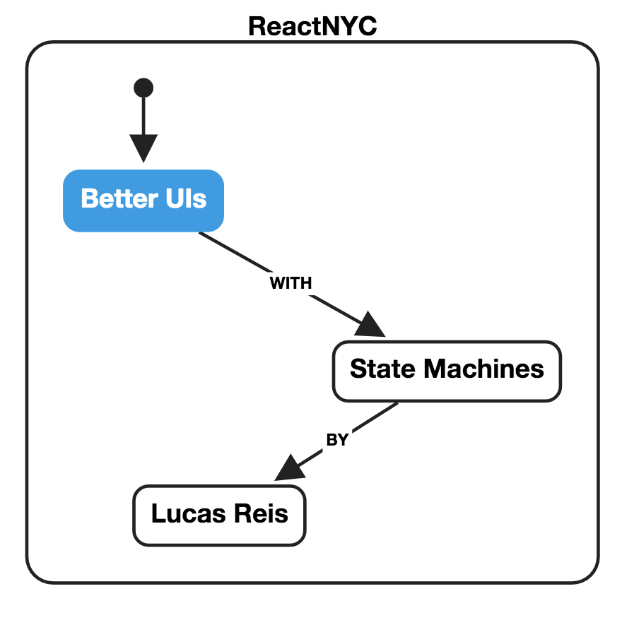
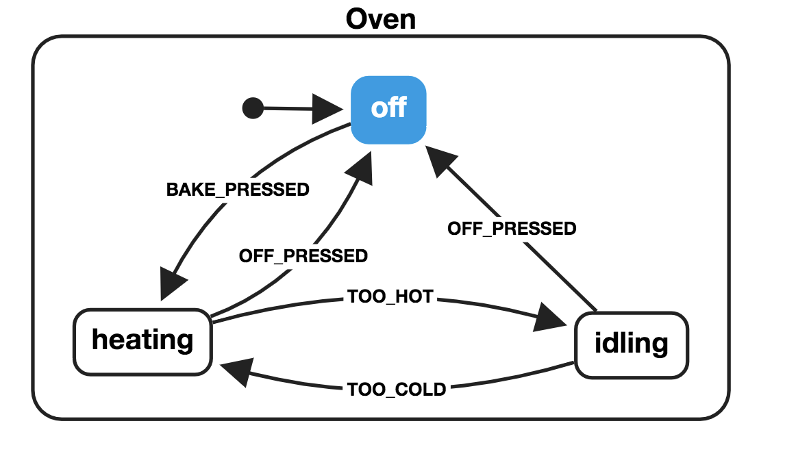
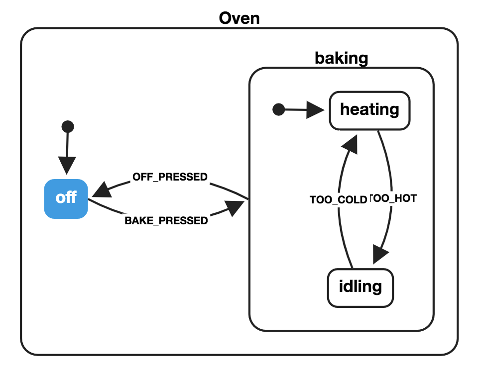
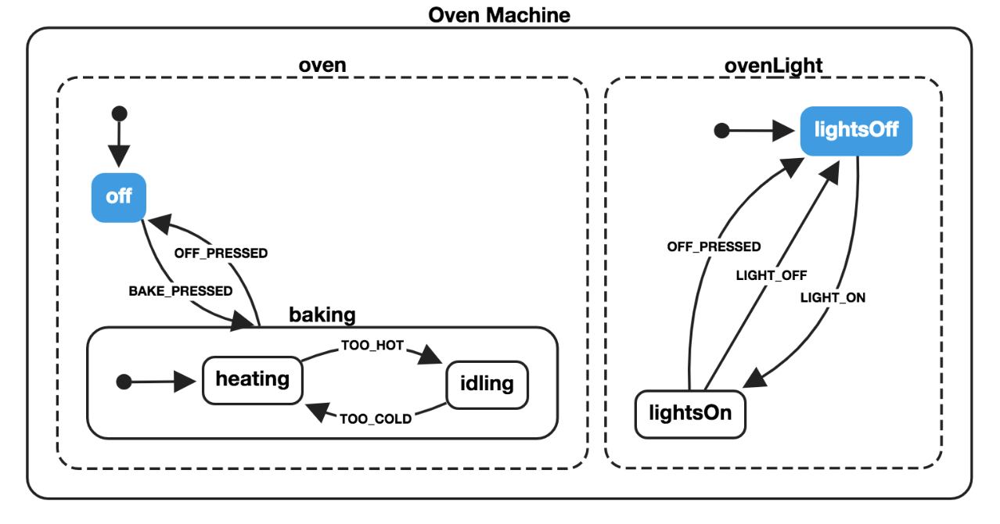

import { Image } from './components'

---

## Lucas Reis

Senior Front End Engineer at Zocdoc 

_@iamlucasmreis_

---

Did you go from 

## Infinite Planning

to 

## No Planning At All

?

---

### We are getting too far to the other side of the pendulum

---

_Wait, are you bringing back WATERFALL???_

---

No, I'm only claiming we need **some** planning

_not two months, but something from two hours to two days!_

---

1. Coding is more **costly** than planning
2. We are able to solve **big problems** and catch bugs with planning
3. During planning we're able to leverage knowledge of **non-coders** too 

---

## Finite State Machines are a great tool for planning UIs

---

### What Are Finite State Machines?

---

### What Are Finite State Machines?

---

### What Are Finite State Machines?

1. A list of **states**
2. One **initial** state
3. A list of events that trigger **transitions**
4. Transitions may be conditional (**guards**)
5. A state can trigger **actions** upon entering or exiting a state

---

### Statecharts FTW

We just need to expand it a bit...

---

### Statecharts FTW

---

### Statecharts FTW

1. Hierachy: states can have **substates**
2. Parallelism: the system may have **multiple** machines
3. Broadcasting: one machine can react to events sent by **other** machines

---

Statecharts are: 

* High-level enough to be able to be developed by non-coders
* Low-level enough to actually help you with your code

---

### Let's implement a React component using a statechart!

---

---

<iframe 
    src="https://codesandbox.io/embed/7y5286moy1"  
    style={{ width: 500, borderRadius: "4px", overflow: "hidden", height: 500 }}
    sandbox="allow-modals allow-forms allow-popups allow-scripts allow-same-origin">
</iframe>

---

### Prototype With SketchSystems

<iframe 
    src="https://sketch.systems/lucasmreis/sketch/13f3650ed126fd197855716a28588da6"
    frameborder="no"
    width="100%"
    height="400">
</iframe>

---

import { Code } from './components'

### Create statechart in xstate/xviz

<Code>
{`
{
  "key": "Oven",
  "initial": "off",
  "states": {
    "off": {
      "on": {
        "BAKE_PRESSED": "heating"
      }
    },
    "heating": {
      "on": {
        "OFF_PRESSED": "off"
      }
    }
  }
}
`}
</Code>

---

---

<iframe 
    src="https://codesandbox.io/embed/7y5286moy1"  
    style={{ width: 500, borderRadius: "4px", overflow: "hidden", height: 500 }}
    sandbox="allow-modals allow-forms allow-popups allow-scripts allow-same-origin">
</iframe>

---
import SyntaxHighlighter from 'react-syntax-highlighter/prism'
import { darcula } from 'react-syntax-highlighter/styles/prism'

### Use React Automata to create the component

1. Declare your extended state

<SyntaxHighlighter language='jsx' style={darcula}>
{`class Container extends React.Component {
  state = {
    selectedCarrier: null,
    selectedPlan: null,
    carriers: [],
    plans: []
  };
`}
</SyntaxHighlighter>

---

2. Actions are component methods

<SyntaxHighlighter language='jsx' style={darcula}>
{`fetchCarriers() {
  getCarriers()
    .then(carriers => this.setState({ carriers }))
    .then(() => this.props.transition("CARRIERS_FETCHED"))
    .catch(() => this.props.transition("FETCH_CARRIERS_ERROR"))
}
fetchPlans() {
  getPlans(this.state.selectedCarrier)
      .then(plans => this.setState({ plans }))
      .then(() => this.props.transition("PLANS_FETCHED"))
      .catch(() => this.props.transition("FETCH_PLANS_ERROR"))
}`} 
</SyntaxHighlighter>

---

3. Trigger events with transition

<SyntaxHighlighter language='jsx' style={darcula}>
{`selectPlan = selectedPlan => {
  this.setState({ selectedPlan });
  this.props.transition("PLAN_SELECTED");
};
reset = () => {
  this.setState({
    selectedCarrier: null,
    selectedPlan: null,
    carriers: [],
    plans: []
  });
  this.props.transition("RESET");
};`} 
</SyntaxHighlighter>

---

4. Use the State and Action components

<SyntaxHighlighter language='jsx' style={darcula}>
{`<State is="menu.visibility.shown">
  
 this.props.transition("CLICKED_OUTSIDE")}
  />
  <State is="menu.insuranceOptions.*.loading">
    <Loading />
  </State>
  <State is="menu.insuranceOptions.carrierSelection.*">
    <InsuranceList list={carriers} onSelect={this.selectCarrier} />
  </State>
  <State is="menu.insuranceOptions.planSelection.*">
    <InsuranceList list={plans} onSelect={this.selectPlan} />
  </State>
  <State is="menu.insuranceOptions.resetInsuranceQuestion">
    <ResetInsuranceQuestion onReset={this.reset} />
  </State>
</State>`} 
</SyntaxHighlighter>

---

5. Wrap it with the statechart in the HOC

<SyntaxHighlighter language='jsx' style={darcula}>
{`const InsurancePicker = withStateMachine(statechart)(Container);`} 
</SyntaxHighlighter>

---
import { ImageV } from './components'

### Use React Automata to create the component

<ImageV src="static/whole-component.png"/>

---

<iframe 
    src="https://codesandbox.io/embed/7y5286moy1"  
    style={{ width: 500, borderRadius: "4px", overflow: "hidden", height: 500 }}
    sandbox="allow-modals allow-forms allow-popups allow-scripts allow-same-origin">
</iframe>

---

Overall benefits

## Preciseness of specs
## Correctness of code

---

### Benefits for a React app

* Smaller React Component
* Less noise, less unimportant state
* No if clauses
* Design help from tooling

---

### Future

* More vizualization tools
* More tools to assert correctness
* More ways to integrate with JS 

---

### Current problems

* Lack of familiarity from devs and designers
* Small ecossystem

---

### Thank you very much!

Lucas Reis

_@iamlucasmreis_

---

### Important links:

* https://statecharts.github.io/
* https://spectrum.chat/statecharts
* https://github.com/davidkpiano/xstate
* https://github.com/MicheleBertoli/react-automata
* https://github.com/avaragado/xstateful
* https://github.com/avaragado/xstateful-react